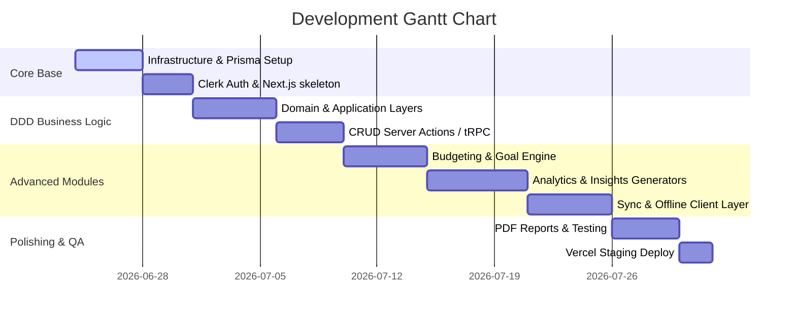

# Folder Structure & Development Roadmap
## Repository Layout, File Mappings, and Phase breakdown

This spec outlines the code organization blueprint and the project schedule required to build out ApexFinance successfully.

---

### 1. Folder Structure Blueprint

The project follows a Domain-Driven Design (DDD) layered folder structure. This keeps code decoupled from framework internals, allowing ease of testing.

```
├── .github/                  # CI/CD workflows (GitHub Actions)
├── docs/                     # Specifications & design documents
├── prisma/
│   └── schema.prisma         # Prisma Schema Definition
├── public/                   # Static assets (logos, vectors)
└── src/
    ├── application/          # Use-Cases, Orchestration & Ports
    │   ├── dtos/             # Data Transfer Objects & Schema checks
    │   ├── ports/            # Repository & Gateway interfaces
    │   └── services/         # Application Business logic
    ├── domain/               # Enterprise Core Business Rules
    │   ├── entities/         # Domain model entities (User, Transaction)
    │   ├── exceptions/       # Core custom domain exceptions
    │   └── value-objects/    # Immutable value classes (Money)
    ├── infrastructure/       # External Adapter Implementations
    │   ├── db/               # Prisma Database adapters (Repository impls)
    │   ├── storage/          # Supabase storage API implementations
    │   ├── notification/     # QStash/Email notify integration
    │   └── config/           # Environment variables validation & keys
    ├── presentation/         # API Gateways & User Interfaces
    │   ├── trpc/             # routers, context setup & schema inputs
    │   ├── components/       # Shadcn UI reusable components
    │   ├── styles/           # Tailwind index.css base setup
    │   └── app/              # Next.js 15 App router (pages, layouts, actions)
    │       ├── layout.tsx    # Core dashboard frame
    │       ├── page.tsx      # Main dashboard home view
    │       ├── transactions/ # Transactions history list & editor
    │       ├── budgets/      # Envelope budget trackers
    │       └── analytics/    # Interactive Recharts graphs
    └── utils/                # General utility helper functions
```

---

### 2. Step-by-Step Implementation Roadmap

The implementation is broken down into structured sprints, allowing continuous testing and integration.



#### Phase 1: Core Setup & Data Infrastructure (Days 1–7)
* Initialize Next.js 15 workspace with TypeScript.
* Install TailwindCSS, Shadcn UI, and Lucide React.
* Write database schema configuration (`prisma/schema.prisma`) and run database migrations on PostgreSQL.
* Set up authentication gates using Clerk Middleware.

#### Phase 2: Domain Modeling & Service Orchestration (Days 8–15)
* Implement domain models: Entities (`Transaction`, `Budget`, `Goal`) and Value Objects (`Money`).
* Draft Repository port interfaces and write concrete implementations matching Prisma queries.
* Set up tRPC routers to connect Presentation layer components to Application services.

#### Phase 3: Dashboard, Budgets & Goal Tracking (Days 16–22)
* Create responsive CSS custom layouts for Mobile-first views.
* Build budgeting envelope panels showing Spent, Limit, and Warning alerts (50%, 75%, 90%, 100%).
* Write the background recurring transactions scheduler (cron script running daily).

#### Phase 4: Analytics, PDF Exports & Local Caching (Days 23–30)
* Connect Recharts graphing engine to dynamically update Net Worth, Spending Trends, and Category breakdowns.
* Integrate local storage synchronization triggers (IndexedDB) for offline transaction queues.
* Write the insights generator algorithm using cached Redis metrics.
* Complete export modules generating clean PDF summaries and CSV worksheets.
