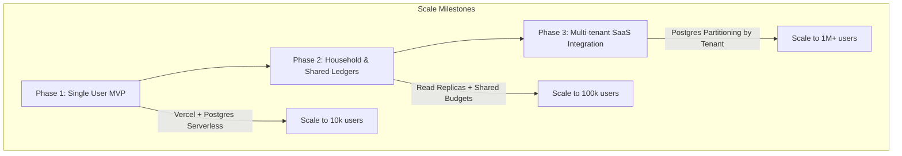

# Security, Performance, and Scalability Architecture

This document describes the security protocols, performance optimizations, and future scale strategy for the ApexFinance platform.

---

### 1. Security Design (PCI-DSS & SOC-2 Compliance Ready)

Even for personal tracking systems, financial details require highest-grade protections.

#### 1.1. Data Encryption
* **Encryption in Transit:** Strict HTTP Strict Transport Security (HSTS) with TLS 1.3 enforced across all Server Actions and tRPC endpoints.
* **Encryption at Rest:**
  * Supabase Storage buckets configured with AES-256 server-side encryption for transaction attachment receipts.
  * PostgreSQL tables holding sensitive logs are encrypted at the storage layer via transparent data encryption (TDE) on AWS RDS/Supabase.
  * Critical data fields (like external bank details, payment account names) can be encrypted at the application level using Node's `crypto` module (AES-256-GCM) with keys stored securely in Vercel Environment variables (never in source code).

#### 1.2. Authentication & Authorization Boundaries
* **Clerk Auth Integrations:** Authentication uses Clerk's JWT verification middleware.
* **Tenant Isolation:** Every database row has a `user_id` foreign key. To prevent ID harvesting or cross-tenant leaks, all repository queries mandate a strict `where: { userId: currentSessionUserId }` constraint.
* **Audit Trails:** All modifications to budgets, data exports, or logins create an entry in the `audit_logs` table, tracking:
  * Timestamp, action description, masked IP addresses, and user-agent details.

---

### 2. Performance Optimization Plan

To keep dashboard render speeds under 100ms and charts completely fluid:

#### 2.1. Caching Topology
* **Edge Caching with Redis:** Upstash Redis is deployed to cache repetitive queries, specifically:
  * Static transaction categories configuration (TTL: 24 Hours).
  * Calculated monthly analytics cache (cleared on new transaction write).
* **Next.js 15 Client Cache:** Using React's cache and stale-while-revalidate (SWR) headers, the browser caches standard summaries, only refreshing them when a background synchronization event completes.

#### 2.2. Query Optimization (Database Level)
* **Pre-aggregations / Materialized Views:** Rather than computing historical net worth by scanning millions of transaction rows, we maintain a `daily_balances_cache` table containing running account values updated incrementally when a transaction is written.
* **Pagination:** Global search queries enforce key-based cursor pagination instead of standard offset pagination (avoiding expensive disk reads on high page numbers).

#### 2.3. Asset Optimization
* **Lazy Loading:** Next.js dynamic imports defer loading heavy graphing libraries (e.g., Recharts) until the user scrolls to the analytics view.
* **Receipt Compression:** Client-side pre-processing compresses and resizes receipt photos (converting to WebP) before pushing them to Supabase Storage, saving client bandwidth and storage space.

---

### 3. Future Scalability Plan

As ApexFinance moves towards team, household, or multi-user startup scopes, the following phases describe the system expansion path.

#### 3.1. Database Partitioning (Scale Milestone)
* **Declarative Partitioning:** As the transactions ledger scales, we will partition the `transactions` table by range using the `date` column (creating tables monthly or quarterly). This limits index sizing and accelerates scanning ranges for reports.
* **Sharding by Tenant:** If scaling to a multi-tenant business SaaS, the primary identifier `user_id` or a new `organization_id` acts as the shard key, splitting database tenants across distinct physical Postgres nodes.

#### 3.2. Sync Engine Evolution
* **Conflict-Free Replicated Data Types (CRDTs):** Shift from simple last-write-wins (LWW) timestamp comparisons to Yjs or Automerge libraries. This enables real-time collaboration where multiple family members can modify budgets or log expenses simultaneously without sync conflict prompts.

#### 3.3. Asynchronous Task Delegation
* Move report PDF compilations and insights generation from Next.js serverless threads (which have execution timeouts) to dedicated background workers running on fly.io or AWS ECS, managed via BullMQ or QStash message queues.
