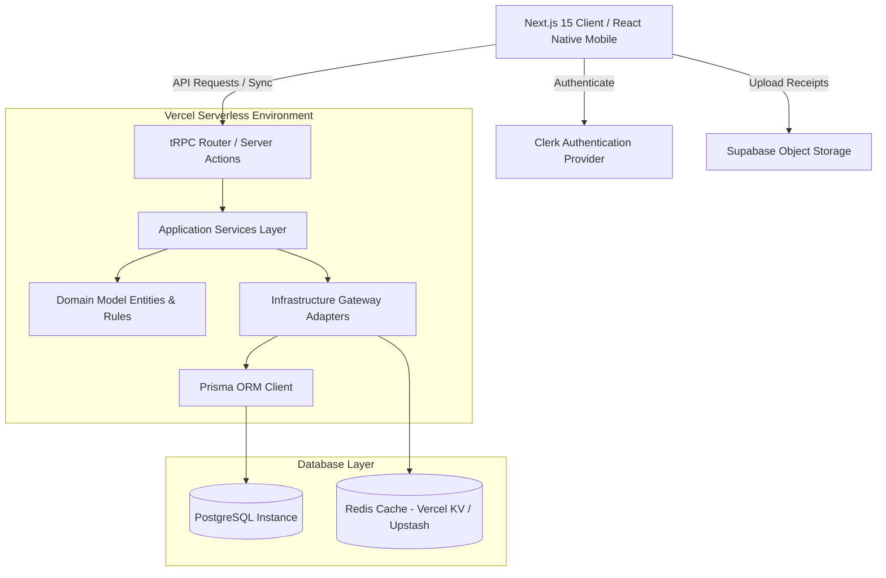

# System Architecture & Low-Level Design (LLD)
## Clean Architecture, DDD, and Service-Layer Patterns

This document describes the high-level infrastructure design and the low-level object-oriented code layout of ApexFinance.

---

### 1. High-Level Architecture (HLD)

The platform is designed around a multi-tier microservices-equivalent modular monolith utilizing **Next.js 15 Server Actions** and **tRPC** as the orchestration layer, backed by **PostgreSQL** and integrated external services.



#### Sub-Systems
1. **Presentation / API Gateway:** Handles client requests, schema validation, and session parsing via Clerk middleware and Zod.
2. **Analytics Service:** Aggregates transactions to calculate monthly patterns. Cached in Upstash Redis to keep load off PostgreSQL.
3. **Notification Engine:** Dispatches alerts on budget breaches and recurring dues. Dispatched asynchronously via edge functions or message queues (Instash/Upstash QStash).
4. **Report Generator Service:** Instantiates server-side PDF generators (e.g., pdfkit) or CSV builders, streaming the final array buffer to Supabase Storage and returning short-lived sign URLs to the client.

---

### 2. Low-Level Design & Clean Architecture Layers

Following strict Clean Architecture rules, dependencies only point inward: **Presentation -> Infrastructure -> Application -> Domain**.

```
┌────────────────────────────────────────────────────────┐
│ Presentation (Next.js Pages, Server Actions, tRPC Router)│
└───────────────────────────┬────────────────────────────┘
                            ▼
┌────────────────────────────────────────────────────────┐
│ Infrastructure (Prisma Implementation, AWS/Supabase S3) │
└───────────────────────────┬────────────────────────────┘
                            ▼
┌────────────────────────────────────────────────────────┐
│ Application (Service Interfaces, Use Cases, DTOs, Ports)│
└───────────────────────────┬────────────────────────────┘
                            ▼
┌────────────────────────────────────────────────────────┐
│ Domain Layer (Entities, Value Objects, Domain Events)  │
└────────────────────────────────────────────────────────┘
```

#### 2.1. Domain Entities & Value Objects (No external dependencies)
```typescript
// Value Object: Money
export class Money {
  constructor(public readonly amount: number, public readonly currency: string = 'INR') {
    if (amount < 0) throw new Error("Amount cannot be negative");
  }
  
  add(other: Money): Money {
    if (this.currency !== other.currency) throw new Error("Currency mismatch");
    return new Money(this.amount + other.amount, this.currency);
  }
}

// Domain Entity: Transaction
export class Transaction {
  constructor(
    public readonly id: string,
    public readonly userId: string,
    public categoryId: string,
    public title: string,
    public amount: Money,
    public type: 'INCOME' | 'EXPENSE' | 'SAVINGS' | 'INVESTMENT' | 'TRANSFER',
    public paymentMethod: string,
    public date: Date,
    public tags: string[] = []
  ) {}
}
```

#### 2.2. Application Layer Ports (Repository Interfaces)
These interfaces define database interactions without exposing Prisma models.
```typescript
export interface ITransactionRepository {
  findById(id: string): Promise<Transaction | null>;
  save(transaction: Transaction): Promise<void>;
  delete(id: string): Promise<void>;
  findByUserIdAndDateRange(userId: string, start: Date, end: Date): Promise<Transaction[]>;
}

export interface IBudgetRepository {
  findByCategory(userId: string, categoryId: string, month: number, year: number): Promise<Budget | null>;
  save(budget: Budget): Promise<void>;
}
```

#### 2.3. Service Layer (Business Orchestration)
Orchestrates entities, handles transaction logic, and dispatches side-effects like checking budget limits.
```typescript
export class TransactionService {
  constructor(
    private readonly transactionRepo: ITransactionRepository,
    private readonly budgetRepo: IBudgetRepository,
    private readonly notificationService: INotificationService
  ) {}

  async logTransaction(dto: CreateTransactionDTO): Promise<Transaction> {
    // 1. Instantiate domain entity & apply business validations
    const money = new Money(dto.amount, dto.currency);
    const transaction = new Transaction(
      crypto.randomUUID(),
      dto.userId,
      dto.categoryId,
      dto.title,
      money,
      dto.type,
      dto.paymentMethod,
      dto.date,
      dto.tags
    );

    // 2. Persist transaction via Repository Port
    await this.transactionRepo.save(transaction);

    // 3. Side-Effect: Check if transaction causes budget overrun
    if (transaction.type === 'EXPENSE') {
      await this.checkBudgetImpact(transaction);
    }

    return transaction;
  }

  private async checkBudgetImpact(transaction: Transaction): Promise<void> {
    const date = transaction.date;
    const budget = await this.budgetRepo.findByCategory(
      transaction.userId,
      transaction.categoryId,
      date.getMonth() + 1,
      date.getFullYear()
    );

    if (budget) {
      const currentMonthExpenses = await this.transactionRepo.findByUserIdAndDateRange(
        transaction.userId,
        new Date(date.getFullYear(), date.getMonth(), 1),
        new Date(date.getFullYear(), date.getMonth() + 1, 0)
      );

      const totalSpent = currentMonthExpenses
        .filter(t => t.categoryId === transaction.categoryId)
        .reduce((sum, t) => sum + t.amount.amount, 0);

      // Check thresholds
      const percentage = (totalSpent / budget.limitAmount) * 100;
      if (percentage >= 100) {
        await this.notificationService.notifyBudgetBreach(transaction.userId, budget, 100);
      } else if (percentage >= 90) {
        await this.notificationService.notifyBudgetBreach(transaction.userId, budget, 90);
      }
    }
  }
}
```

---

### 3. Data Transfer Objects (DTO) & Input Validation Layer

We enforce schema checking at the presentation layer entrance using **Zod**.
```typescript
import { z } from 'zod';

export const CreateTransactionSchema = z.object({
  title: z.string().min(2, "Title must contain at least 2 characters").max(100),
  description: z.string().optional(),
  amount: z.number().positive("Amount must be greater than zero"),
  currency: z.string().length(3).default('INR'),
  type: z.enum(['INCOME', 'EXPENSE', 'SAVINGS', 'INVESTMENT', 'TRANSFER']),
  paymentMethod: z.enum(['CASH', 'UPI', 'CARD', 'BANK_TRANSFER', 'WALLET']),
  categoryId: z.string().uuid("Invalid category identifier"),
  goalId: z.string().uuid().optional(),
  date: z.date(),
  tags: z.array(z.string()).default([]),
});

export type CreateTransactionDTO = z.infer<typeof CreateTransactionSchema>;
```

---

### 4. Error Handling and Logging Strategy

#### 4.1. Error Hierarchy
All exceptions inherit from a base `AppError`, preventing database implementation errors (like raw SQL leaks) from escaping to the client.
```typescript
export class AppError extends Error {
  constructor(
    public readonly code: string,
    message: string,
    public readonly statusCode: number = 400
  ) {
    super(message);
    Object.setPrototypeOf(this, new.target.prototype);
  }
}

export class EntityNotFoundError extends AppError {
  constructor(entity: string, id: string) {
    super('ENTITY_NOT_FOUND', `${entity} with ID ${id} was not found.`, 404);
  }
}

export class BudgetViolationException extends AppError {
  constructor(message: string) {
    super('BUDGET_VIOLATION', message, 422);
  }
}
```

#### 4.2. Logging Architecture
The server leverages **Pino** or **Winston** structured JSON output, integrated with OpenTelemetry hooks to stream traces to platform monitors (e.g., Datadog, Axiom, or Vercel Logs).
* **Metadata Attachment:** Every log statement must bind a `correlationId` initiated by the incoming request middleware to track execution paths across Server Actions and db calls.
* **Sensitive Data Scrubbing:** Regex patterns automatically run over logs to strip out transaction descriptions, notes, names, and email addresses to guarantee financial privacy compliance.
